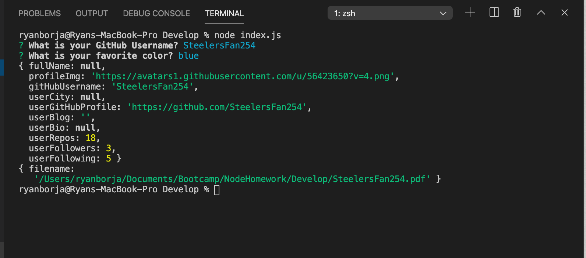
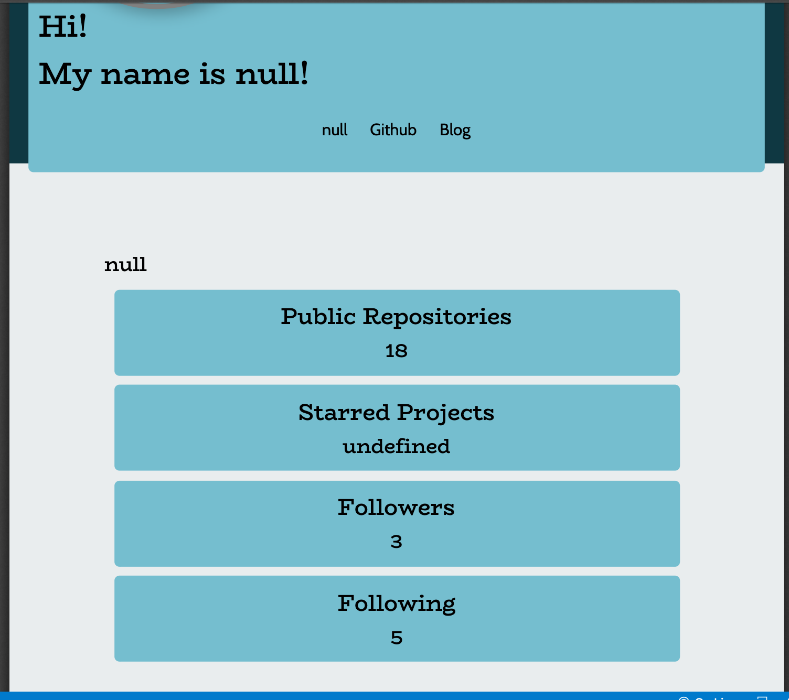

# GitHub Profile Generator
A CLI based app that produces a pdf of GitHub info based on the username that is given.

## Getting Started
First you will need to do an npm install. Then type index.js to get the app running.
You will be prompted with to input a GitHub username. After you put in a username a pdf file will appear the person's username.pdf. Right click and select "view pdf" to get the results.

## Built With
    *html
    *css
    *javascript
    *node.js
    *inquirer
    *fs
    *axios
    *html
    *pdf

Examples (ignore the nulls. Thats my github. Not my app)

 
 